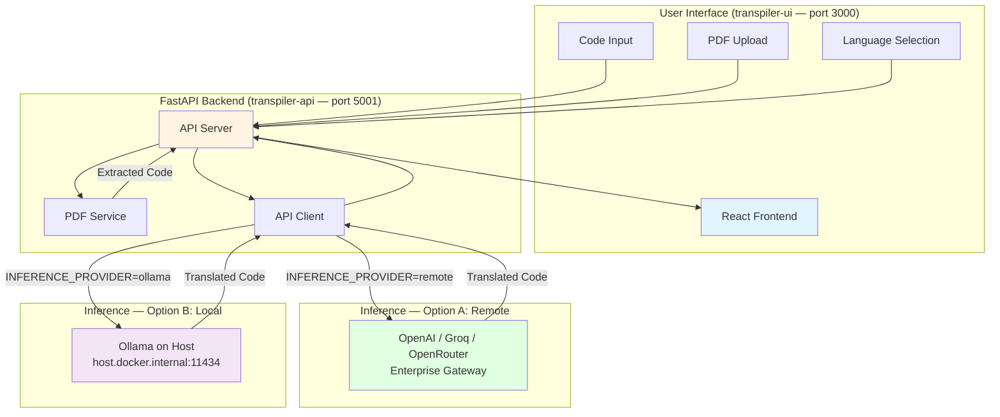

<p align="center">
  
</p>

# CodeTrans — AI-Powered Code Translation

An AI-powered full-stack application that translates source code between programming languages. Paste code (or upload a PDF), pick your source and target languages, and get idiomatic translated output in seconds — powered by any OpenAI-compatible LLM endpoint or a locally running Ollama model.

---

## Table of Contents

- [Project Overview](#project-overview)
- [How It Works](#how-it-works)
- [Architecture](#architecture)
  - [Architecture Diagram](#architecture-diagram)
  - [Architecture Components](#architecture-components)
  - [Service Components](#service-components)
  - [Typical Flow](#typical-flow)
- [Get Started](#get-started)
  - [Prerequisites](#prerequisites)
  - [Quick Start (Docker Deployment)](#quick-start-docker-deployment)
  - [Local Development Setup](#local-development-setup)
- [Project Structure](#project-structure)
- [Usage Guide](#usage-guide)
- [Performance Tips](#performance-tips)
- [LLM Provider Configuration](#llm-provider-configuration)
  - [OpenAI](#openai)
  - [Groq](#groq)
  - [Ollama](#ollama)
  - [OpenRouter](#openrouter)
  - [Custom OpenAI-Compatible API](#custom-openai-compatible-api)
  - [Switching Providers](#switching-providers)
- [Environment Variables](#environment-variables)
  - [Core LLM Configuration](#core-llm-configuration)
  - [Generation Parameters](#generation-parameters)
  - [File Upload Limits](#file-upload-limits)
  - [Session Management](#session-management)
  - [Server Configuration](#server-configuration)
- [Technology Stack](#technology-stack)
- [Troubleshooting](#troubleshooting)
- [License](#license)
- [Disclaimer](#disclaimer)

---

## Project Overview

**CodeTrans** demonstrates how code-specialized large language models can be used to translate source code between programming languages. It supports six languages — Java, C, C++, Python, Rust, and Go — and works with any OpenAI-compatible inference endpoint or a locally running Ollama instance.

This makes CodeTrans suitable for:

- **Enterprise deployments** — connect to a GenAI Gateway or any managed LLM API
- **Air-gapped environments** — run fully offline with Ollama and a locally hosted model
- **Local experimentation** — quick setup on a laptop with GPU-accelerated inference
- **Hardware benchmarking** — measure SLM throughput on Apple Silicon, CUDA, or Intel Gaudi hardware

---

## How It Works

1. The user pastes code or uploads a PDF in the browser.
2. The React frontend sends the source code and language selection to the FastAPI backend.
3. If a PDF was uploaded, a text extraction service pulls the code out of the document.
4. The backend constructs a structured prompt and calls the configured LLM endpoint (remote API or local Ollama).
5. The LLM returns the translated code, which is displayed in the output panel.
6. The user copies the result with one click.

All inference logic is abstracted behind a single `INFERENCE_PROVIDER` environment variable — switching between providers requires only a `.env` change and a container restart.

---

## Architecture

The application follows a modular two-service architecture with a React frontend and a FastAPI backend. The backend handles all inference orchestration, PDF extraction, and optional LLM observability tracing. The inference layer is fully pluggable — any OpenAI-compatible remote endpoint or a locally running Ollama instance can be used without any code changes.

### Architecture Diagram



### Architecture Components

**Frontend (React + Vite)**
- Side-by-side code editor with language pill selectors for source and target
- PDF drag-and-drop upload that populates the source panel automatically
- Real-time character counter and live status indicator
- Dark mode (default) with `localStorage` persistence and flash prevention
- One-click copy of translated output
- Nginx serves the production build and proxies all `/api/` requests to the backend

**Backend Services**
- **API Server** (`server.py`): FastAPI application with CORS middleware, request validation, and routing
- **API Client** (`services/api_client.py`): Handles both inference paths — text completions for remote endpoints and chat completions for Ollama — with token-based auth support
- **PDF Service** (`services/pdf_service.py`): Extracts code from uploaded PDF files using pattern recognition

**External Integration**
- **Remote inference**: Any OpenAI-compatible API (OpenAI, Groq, OpenRouter, GenAI Gateway)
- **Local inference**: Ollama running natively on the host machine, accessed from the container via `host.docker.internal:11434`

### Service Components

| Service | Container | Host Port | Description |
|---|---|---|---|
| `transpiler-api` | `transpiler-api` | `5001` | FastAPI backend — input validation, PDF extraction, inference orchestration |
| `transpiler-ui` | `transpiler-ui` | `3000` | React frontend — served by Nginx, proxies `/api/` to the backend |

> **Ollama is intentionally not a Docker service.** On macOS (Apple Silicon), running Ollama in Docker bypasses Metal GPU (MPS) acceleration, resulting in CPU-only inference. Ollama must run natively on the host so the backend container can reach it via `host.docker.internal:11434`.

### Typical Flow

1. User enters code or uploads a PDF in the web UI.
2. The backend validates the input; PDF text is extracted if needed.
3. The backend calls the configured inference endpoint (remote API or Ollama).
4. The model returns translated code, which is displayed in the right panel.
5. User copies the result with one click.

---

## Get Started

### Prerequisites

Before you begin, ensure you have the following installed and configured:

- **Docker and Docker Compose** (v2)
  - [Install Docker](https://docs.docker.com/get-docker/)
  - [Install Docker Compose](https://docs.docker.com/compose/install/)
- An inference endpoint — one of:
  - A remote OpenAI-compatible API key (OpenAI, Groq, OpenRouter, or enterprise gateway)
  - [Ollama](https://ollama.com/download) installed natively on the host machine

#### Verify Installation

```bash
docker --version
docker compose version
docker ps
```

### Quick Start (Docker Deployment)

#### 1. Clone the Repository

```bash
git clone https://github.com/cld2labs/CodeTrans.git
cd CodeTrans
```

#### 2. Configure the Environment

```bash
cp .env.example .env
```

Open `.env` and set `INFERENCE_PROVIDER` plus the corresponding variables for your chosen provider. See [LLM Provider Configuration](#llm-provider-configuration) for per-provider instructions.

#### 3. Build and Start the Application

```bash
# Standard (attached)
docker compose up --build

# Detached (background)
docker compose up -d --build
```

#### 4. Access the Application

Once containers are running:

- **Frontend UI**: http://localhost:3000
- **Backend API**: http://localhost:5001
- **API Docs (Swagger)**: http://localhost:5001/docs

#### 5. Verify Services

```bash
# Health check
curl http://localhost:5001/health

# View running containers
docker compose ps
```

**View logs:**

```bash
# All services
docker compose logs -f

# Backend only
docker compose logs -f transpiler-api

# Frontend only
docker compose logs -f transpiler-ui
```

#### 6. Stop the Application

```bash
docker compose down
```

### Local Development Setup

Run the backend and frontend directly on the host without Docker.

**Backend (Python / FastAPI)**

```bash
cd api
python -m venv .venv
source .venv/bin/activate        # Windows: .venv\Scripts\activate
pip install -r requirements.txt
cp ../.env.example ../.env       # configure your .env at the repo root
uvicorn server:app --reload --port 5001
```

**Frontend (Node / Vite)**

```bash
cd ui
npm install
npm run dev
```

The Vite dev server proxies `/api/` to `http://localhost:5001`. Open http://localhost:5173.

---

## Project Structure

```
CodeTrans/
├── api/                        # FastAPI backend
│   ├── config.py               # All environment-driven settings
│   ├── models.py               # Pydantic request/response schemas
│   ├── server.py               # FastAPI app, routes, and middleware
│   ├── services/
│   │   ├── api_client.py       # LLM inference client (remote + Ollama)
│   │   └── pdf_service.py      # PDF text and code extraction
│   ├── Dockerfile
│   └── requirements.txt
├── ui/                         # React frontend
│   ├── src/
│   │   ├── App.jsx
│   │   ├── components/
│   │   │   ├── CodeTranslator.jsx   # Main editor panel
│   │   │   ├── Header.jsx
│   │   │   ├── PDFUploader.jsx
│   │   │   └── StatusBar.jsx
│   │   └── main.jsx
│   ├── Dockerfile
│   └── vite.config.js
├── docs/
│   └── assets/                 # Documentation images
├── docker-compose.yaml         # Main orchestration file
├── .env.example                # Environment variable reference
└── README.md
```

---

## Usage Guide

**Translate code:**

1. Open the application at http://localhost:3000.
2. Select the source language using the pill buttons at the top-left.
3. Select the target language using the pill buttons at the top-right.
4. Paste or type your code in the left panel.
5. Click **Translate Code**.
6. View the result in the right panel and click **Copy** to copy it to the clipboard.

**Upload a PDF:**

1. Scroll to the **Upload PDF** section below the code panels.
2. Drag and drop a PDF file, or click to browse.
3. Code is extracted automatically and placed in the source panel.
4. Select your languages and translate as normal.

**Dark mode:**

The app defaults to dark mode. Click the theme toggle in the header to switch to light mode. Your preference is saved in `localStorage`.

---

## Performance Tips

- **Use the largest model your hardware can sustain.** `codellama:34b` produces the best translation quality; `codellama:7b` is faster and good for benchmarking.
- **Lower `LLM_TEMPERATURE`** (e.g., `0.1`) for more deterministic, literal translations. Raise it slightly (e.g., `0.3–0.5`) if you want more idiomatic rewrites.
- **Keep inputs under `MAX_CODE_LENGTH`.** Shorter, focused snippets translate more accurately than entire files. Split large files by class or function.
- **On Apple Silicon**, always run Ollama natively — never inside Docker. The MPS (Metal) GPU backend delivers 5–10x the throughput of CPU-only inference.
- **On Linux with an NVIDIA GPU**, set `CUDA_VISIBLE_DEVICES` before starting Ollama to target a specific GPU.
- **For enterprise remote APIs**, choose a model with a large context window (≥16k tokens) to avoid truncation on longer inputs.

---

## LLM Provider Configuration

All providers are configured via the `.env` file. Set `INFERENCE_PROVIDER=remote` for any cloud or API-based provider, and `INFERENCE_PROVIDER=ollama` for local inference.

### OpenAI

```bash
INFERENCE_PROVIDER=remote
INFERENCE_API_ENDPOINT=https://api.openai.com
INFERENCE_API_TOKEN=sk-...
INFERENCE_MODEL_NAME=gpt-4o
```

Recommended models: `gpt-4o`, `gpt-4o-mini`, `gpt-4-turbo`.

### Groq

Groq provides OpenAI-compatible endpoints with extremely fast inference (LPU hardware).

```bash
INFERENCE_PROVIDER=remote
INFERENCE_API_ENDPOINT=https://api.groq.com/openai
INFERENCE_API_TOKEN=gsk_...
INFERENCE_MODEL_NAME=llama3-70b-8192
```

Recommended models: `llama3-70b-8192`, `mixtral-8x7b-32768`, `llama-3.1-8b-instant`.

### Ollama

Runs inference locally on the host machine with full GPU acceleration.

1. Install Ollama: https://ollama.com/download
2. Pull a model:

   ```bash
   # Production — best translation quality (~20 GB)
   ollama pull codellama:34b

   # Testing / SLM benchmarking (~4 GB, fast)
   ollama pull codellama:7b

   # Other strong code models
   ollama pull deepseek-coder:6.7b
   ollama pull qwen2.5-coder:7b
   ollama pull codellama:13b
   ```

3. Confirm Ollama is running:

   ```bash
   curl http://localhost:11434/api/tags
   ```

4. Configure `.env`:

   ```bash
   INFERENCE_PROVIDER=ollama
   INFERENCE_API_ENDPOINT=http://host.docker.internal:11434
   INFERENCE_MODEL_NAME=codellama:7b
   # INFERENCE_API_TOKEN is not required for Ollama
   ```

### OpenRouter

OpenRouter provides a unified API across hundreds of models from different providers.

```bash
INFERENCE_PROVIDER=remote
INFERENCE_API_ENDPOINT=https://openrouter.ai/api
INFERENCE_API_TOKEN=sk-or-...
INFERENCE_MODEL_NAME=meta-llama/llama-3.1-70b-instruct
```

Recommended models: `meta-llama/llama-3.1-70b-instruct`, `deepseek/deepseek-coder`, `qwen/qwen-2.5-coder-32b-instruct`.

### Custom OpenAI-Compatible API

Any enterprise gateway that exposes an OpenAI-compatible `/v1/completions` or `/v1/chat/completions` endpoint works without code changes.

**GenAI Gateway (LiteLLM-backed):**

```bash
INFERENCE_PROVIDER=remote
INFERENCE_API_ENDPOINT=https://genai-gateway.example.com
INFERENCE_API_TOKEN=your-litellm-master-key
INFERENCE_MODEL_NAME=codellama/CodeLlama-34b-Instruct-hf
```

If the endpoint uses a private domain mapped in `/etc/hosts`, also set:

```bash
LOCAL_URL_ENDPOINT=your-private-domain.internal
```

### Switching Providers

1. Edit `.env` with the new provider's values.
2. Restart the backend container:

   ```bash
   docker compose restart transpiler-api
   ```

No rebuild is needed — all settings are injected at runtime via environment variables.

---

## Environment Variables

All variables are defined in `.env` (copied from `.env.example`). The backend reads them at startup via `python-dotenv`.

### Core LLM Configuration

| Variable | Description | Default | Type |
|---|---|---|---|
| `INFERENCE_PROVIDER` | `remote` for any OpenAI-compatible API; `ollama` for local inference | `remote` | string |
| `INFERENCE_API_ENDPOINT` | Base URL of the inference service (no `/v1` suffix) | — | string |
| `INFERENCE_API_TOKEN` | Bearer token / API key. Not required for Ollama | — | string |
| `INFERENCE_MODEL_NAME` | Model identifier passed to the API | `codellama/CodeLlama-34b-Instruct-hf` | string |

### Generation Parameters

| Variable | Description | Default | Type |
|---|---|---|---|
| `LLM_TEMPERATURE` | Sampling temperature. Lower = more deterministic output (0.0–2.0) | `0.2` | float |
| `LLM_MAX_TOKENS` | Maximum tokens in the translated output | `4096` | integer |
| `MAX_CODE_LENGTH` | Maximum input code length in characters | `4000` | integer |

### File Upload Limits

| Variable | Description | Default | Type |
|---|---|---|---|
| `MAX_FILE_SIZE` | Maximum PDF upload size in bytes (default: 10 MB) | `10485760` | integer |

### Session Management

| Variable | Description | Default | Type |
|---|---|---|---|
| `CORS_ALLOW_ORIGINS` | Allowed CORS origins (comma-separated or `*`). Restrict in production | `["*"]` | string |

### Server Configuration

| Variable | Description | Default | Type |
|---|---|---|---|
| `BACKEND_PORT` | Port the FastAPI server listens on | `5001` | integer |
| `LOCAL_URL_ENDPOINT` | Private domain in `/etc/hosts` the container must resolve. Leave as `not-needed` if not applicable | `not-needed` | string |
| `VERIFY_SSL` | Set `false` only for environments with self-signed certificates | `true` | boolean |

---

## Technology Stack

### Backend

- **Framework**: FastAPI (Python 3.11+) with Uvicorn ASGI server
- **LLM Integration**: `openai` Python SDK — works with any OpenAI-compatible endpoint (remote or Ollama)
- **Local Inference**: Ollama — runs natively on host with full Metal (MPS) or CUDA GPU acceleration
- **PDF Processing**: PyMuPDF (`fitz`) for text and code extraction from uploaded documents
- **Config Management**: `python-dotenv` for environment variable injection at startup
- **Data Validation**: Pydantic v2 for request/response schema enforcement

### Frontend

- **Framework**: React 18 with Vite (fast HMR and production bundler)
- **Styling**: Tailwind CSS v3 with custom `surface-*` dark mode color palette
- **Production Server**: Nginx — serves the built assets and proxies `/api/` to the backend container
- **UI Features**: Language pill selectors, side-by-side code editor, drag-and-drop PDF upload, real-time character counter, one-click copy, dark/light theme toggle

---

## Troubleshooting

For common issues and solutions, see [TROUBLESHOOTING.md](./TROUBLESHOOTING.md).

### Common Issues

**Issue: Backend returns 500 on translate**

```bash
# Check backend logs for error details
docker compose logs backend

# Verify the inference endpoint and token are set correctly
grep INFERENCE .env
```

- Confirm `INFERENCE_API_ENDPOINT` is reachable from your machine.
- Verify `INFERENCE_API_TOKEN` is valid and has the correct permissions.

**Issue: Ollama connection refused**

```bash
# Confirm Ollama is running on the host
curl http://localhost:11434/api/tags

# If not running, start it
ollama serve
```

**Issue: Ollama is slow / appears to be CPU-only**

- Ensure Ollama is running natively on the host, **not** inside Docker.
- On macOS, verify the Ollama app is using MPS in Activity Monitor (GPU History).
- See the [Ollama](#ollama) section for correct setup.

**Issue: SSL certificate errors**

```bash
# In .env
VERIFY_SSL=false

# Restart the backend
docker compose restart transpiler-api
```

**Issue: PDF upload fails or returns no code**

- Max file size: 10 MB (`MAX_FILE_SIZE`)
- Supported format: PDF only (text-based; scanned image PDFs are not supported)
- Ensure the file is not corrupted or password-protected

**Issue: Frontend cannot connect to API**

```bash
# Verify both containers are running
docker compose ps

# Check CORS settings
grep CORS .env
```

Ensure `CORS_ALLOW_ORIGINS` includes the frontend origin (e.g., `http://localhost:3000`).

**Issue: Private domain not resolving inside container**

Set `LOCAL_URL_ENDPOINT=your-private-domain.internal` in `.env` — this adds the host-gateway mapping for the container.

### Debug Mode

Enable verbose logging for deeper inspection:

```bash
# Not a built-in env var — increase FastAPI log level via Uvicorn
# Edit docker-compose.yaml command or run locally:
uvicorn server:app --reload --port 5001 --log-level debug
```

Or view real-time container logs:

```bash
docker compose logs -f transpiler-api
```

---

## License

This project is licensed under our [LICENSE](./LICENSE.md) file for details.

---

## Disclaimer

**CodeTrans** is provided as-is for demonstration and educational purposes. While we strive for accuracy:

- Translated code should be reviewed by a qualified engineer before use in production systems
- Do not rely solely on AI-generated translations without testing and validation
- Do not submit confidential or proprietary code to third-party API providers without reviewing their data handling policies
- The quality of translation depends on the underlying model and may vary across language pairs and code complexity

For full disclaimer details, see [DISCLAIMER.md](./DISCLAIMER.md).
