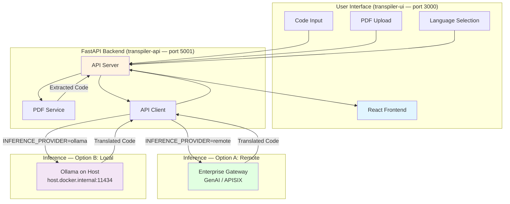

# CodeTrans — AI-Powered Code Translation

A full-stack code translation application that converts source code between programming languages using AI. Built with a FastAPI backend and a React + Vite + Tailwind CSS frontend, orchestrated via Docker Compose.

## Table of Contents

- [Project Overview](#project-overview)
- [Features](#features)
- [Architecture](#architecture)
- [Prerequisites](#prerequisites)
  - [System Requirements](#system-requirements)
  - [Inference Provider Options](#inference-provider-options)
  - [Verify Docker Installation](#verify-docker-installation)
- [Quick Start](#quick-start)
  - [Clone the Repository](#clone-the-repository)
  - [Configure the Environment](#configure-the-environment)
  - [Run the Application](#run-the-application)
- [Using the Application](#using-the-application)
  - [Stopping the Application](#stopping-the-application)
- [Troubleshooting](#troubleshooting)
- [Validated Models](#validated-models)

---

## Project Overview

**CodeTrans** demonstrates how code-specialized large language models can be used to translate source code between different programming languages. It supports two inference modes:

- **Remote** — any OpenAI-compatible enterprise endpoint (GenAI Gateway, APISIX Gateway, etc.)
- **Ollama** — local inference running natively on the host machine, with full GPU acceleration on Apple Silicon

This makes CodeTrans suitable for enterprise deployments, air-gapped environments, local experimentation, and hardware benchmarking.

---

## Features

**Backend**

- Code translation across 6 languages: Java, C, C++, Python, Rust, Go
- Dual inference path: text completions for remote APIs, chat completions for Ollama
- PDF code extraction with pattern recognition (drag-and-drop upload)
- Token-based authentication for enterprise gateways (GenAI / APISIX)
- Input validation, file size limits, and comprehensive error handling
- Health check endpoint
- Modular architecture (`config` → `models` → `services`)

**Frontend**

- Side-by-side code editor with language pill selectors
- PDF file upload with drag-and-drop support
- Real-time character counter
- Dark mode (default) with localStorage persistence
- One-click copy of translated output
- Live status indicator
- Responsive, mobile-friendly layout

---

## Architecture



**Service components:**

| Service | Container | Host Port | Description |
|---|---|---|---|
| `transpiler-api` | `transpiler-api` | `5001` | FastAPI backend — validation, PDF extraction, inference orchestration |
| `transpiler-ui` | `transpiler-ui` | `3000` | React frontend — served by Nginx, proxies `/api/` to the backend |

> **Ollama is intentionally not a Docker service.** On macOS (Apple Silicon), running Ollama in Docker bypasses Metal GPU (MPS) acceleration and falls back to CPU-only inference. Ollama must run natively on the host so the backend container can reach it via `host.docker.internal:11434`.

**Typical request flow:**

1. User enters code or uploads a PDF in the web UI.
2. The backend validates the input; PDF text is extracted if needed.
3. The backend calls the configured inference endpoint (remote or Ollama).
4. The model returns translated code, which is displayed in the right panel.
5. User copies the result with one click.

---

## Prerequisites

### System Requirements

- **Docker** and **Docker Compose**
- An inference endpoint — either a remote gateway (Option A) or [Ollama](https://ollama.com/download) installed natively on the host (Option B)

### Inference Provider Options

#### Option A — Remote OpenAI-compatible API (`INFERENCE_PROVIDER=remote`)

Supports any OpenAI-compatible enterprise inference endpoint:

- **GenAI Gateway** — provide the base URL and your `litellm_master_key` as the token
- **APISIX Gateway** — provide the gateway URL (including model name in path) and a Keycloak-generated token

Set in `.env`:

```bash
INFERENCE_PROVIDER=remote
INFERENCE_API_ENDPOINT=https://your-gateway.example.com
INFERENCE_API_TOKEN=your-token-here
INFERENCE_MODEL_NAME=codellama/CodeLlama-34b-Instruct-hf
```

#### Option B — Ollama local inference (`INFERENCE_PROVIDER=ollama`)

Runs inference on the host machine with full GPU acceleration (Metal on Apple Silicon, CUDA on Linux).

1. Install Ollama: https://ollama.com/download
2. Pull a model:

   ```bash
   # Production — best translation quality (~20 GB)
   ollama pull codellama:34b

   # Testing / SLM benchmarking (~4 GB, fast)
   ollama pull codellama:7b

   # Other recommended code models
   ollama pull deepseek-coder:6.7b
   ollama pull qwen2.5-coder:7b
   ollama pull codellama:13b
   ```

3. Confirm Ollama is running:

   ```bash
   curl http://localhost:11434/api/tags
   ```

4. Set in `.env`:

   ```bash
   INFERENCE_PROVIDER=ollama
   INFERENCE_API_ENDPOINT=http://host.docker.internal:11434
   INFERENCE_MODEL_NAME=codellama:7b
   # INFERENCE_API_TOKEN is not required for Ollama
   ```

### Verify Docker Installation

```bash
docker --version
docker compose version
docker ps
```

---

## Quick Start

### Clone the Repository

```bash
git clone https://github.com/cld2labs/CodeTrans.git
cd CodeTrans
```

### Configure the Environment

Copy the example file and fill in your values:

```bash
cp .env.example .env
```

Open `.env` and set `INFERENCE_PROVIDER` and the corresponding variables for your chosen inference path (see [Inference Provider Options](#inference-provider-options) above).

**Key settings reference:**

| Variable | Default | Description |
|---|---|---|
| `INFERENCE_PROVIDER` | `remote` | `remote` or `ollama` |
| `INFERENCE_API_ENDPOINT` | — | Base URL of inference service |
| `INFERENCE_API_TOKEN` | — | Auth token (not needed for Ollama) |
| `INFERENCE_MODEL_NAME` | `codellama/CodeLlama-34b-Instruct-hf` | Model identifier |
| `LLM_TEMPERATURE` | `0.2` | Lower = more deterministic output |
| `LLM_MAX_TOKENS` | `4096` | Max tokens in translated output |
| `MAX_CODE_LENGTH` | `8000` | Max input code length in characters |
| `LOCAL_URL_ENDPOINT` | `not-needed` | Only set if using a private domain in `/etc/hosts` |
| `VERIFY_SSL` | `true` | Set `false` only for self-signed cert environments |

### Run the Application

```bash
# Build and start both services
docker compose up --build

# Or in detached mode
docker compose up -d --build
```

- UI: http://localhost:3000
- API: http://localhost:5001

**View logs:**

```bash
# All services
docker compose logs -f

# Backend only
docker compose logs -f transpiler-api

# Frontend only
docker compose logs -f transpiler-ui
```

**Verify services are healthy:**

```bash
curl http://localhost:5001/health
docker compose ps
```

---

## Using the Application

**Translate code:**

1. Select the source language using the pill buttons at the top.
2. Select the target language.
3. Paste or type your code in the left panel.
4. Click **Translate Code**.
5. View the result in the right panel and click **Copy** to copy it.

**Upload a PDF:**

1. Scroll to the **Upload PDF** section.
2. Drag and drop a PDF, or click to browse.
3. Code is extracted automatically and placed in the source panel.
4. Select languages and translate as normal.

### Stopping the Application

```bash
docker compose down
```

---

## Troubleshooting

For common issues and solutions, see [TROUBLESHOOTING.md](./TROUBLESHOOTING.md).

---

## Validated Models

| Model | Provider | Hardware |
|---|---|---|
| `codellama/CodeLlama-34b-Instruct-hf` | Remote | Intel Gaudi |
| `Qwen/Qwen3-4B-Instruct-2507` | Remote | Intel Xeon |
| `codellama:34b` | Ollama | Apple Silicon (M-series) |
| `codellama:7b` | Ollama | Apple Silicon (M-series) — recommended for SLM benchmarking |
